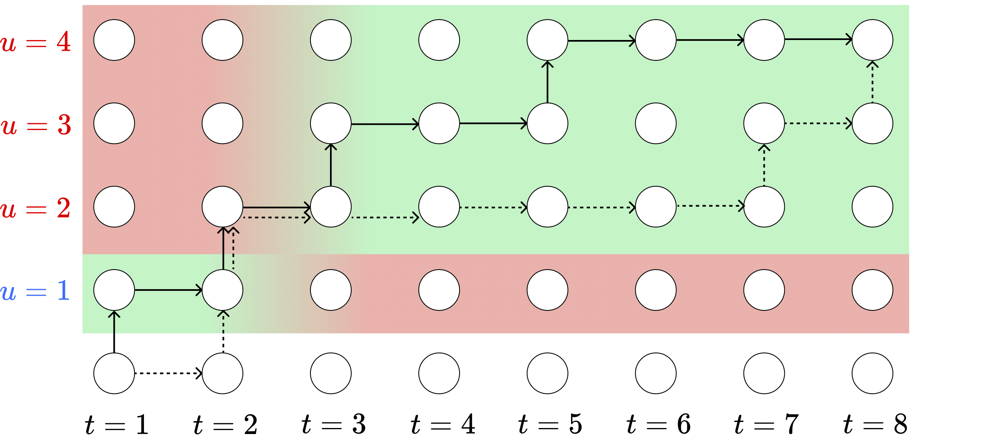
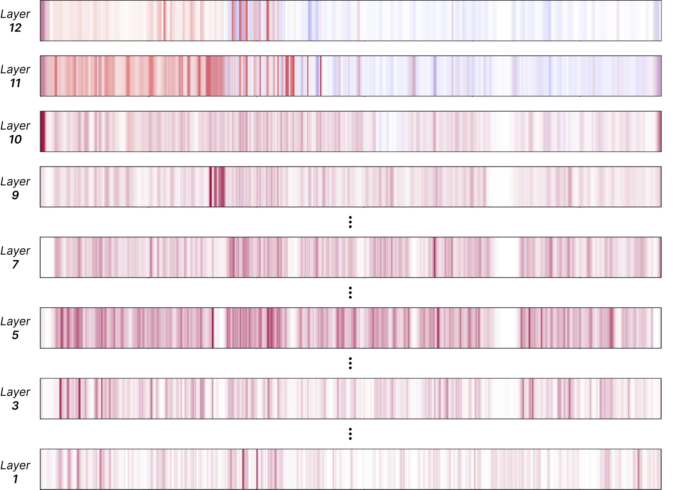

# Disentangling Speakers in Multi-Talker Speech Recognition with Speaker-Aware CTC
><em> In International Conference on Acoustics, Speech, and Signal Processing (ICASSP), 2025 
<br> Authors: Jiawen Kang, Lingwei Meng, Mingyu Cui, Yuejiao Wang, Xixin Wu, Xunying Liu, Helen Meng</em>

[PDF Paper](https://arxiv.org/pdf/2409.12388) | [HTML Paper](https://arxiv.org/html/2409.12388v1) | [Citation](#citation)

This repository contains the core implementation of the <em>Speaker-aware CTC (SACTC) </em> algorithm for multi-talker overlapped speech recognition.

## SACTC - a Quick Preview

Speaker-aware CTC (SACTC) is a variant of CTC training objective, aims to control the CTC alighment with considering the speaker identity information of text tokens.
It is build upon the [Bayesian Risk CTC](https://openreview.net/forum?id=Bd7GueaTxUz) framework, but specially designed for multi-talker overlapped speech recognition.


As illustrated in the below figure, tokens <span style="color:royalblue">1</span> and <span style="color:lightcoral">2,3,4</span> are from different speakers, while <span style="color:lightgreen">green area</span> indicates encouraged alignment pahts. 
<em>SACTC requires the front-end encoder to disentangle separate speakers onto specific timeframes</em> ({$u_1$} is at $t_1-t_2$; {$u_2$,$u_3$,$u_4$} are at $t_3-t_8$).
<div align=center>
  
</div>

Visulizations of Conformer attention maps show the overllaped two speakers generally attend all frames in shallower blocks, while from layer 10 onwards, two speakers begin to focus on distinct temporal regions. In the below figure, red and blue colors represent attentions from two speakers, purple color represents two speakers attending simultaneously.
<div align=center>
  
</div>

## Requirments
- ESPnet and its required dependencies
- Additional packages used for scoring can be found in `./scoring/requirements.txt`

## Usage
To use this code, please:
1. Replace the original ESPnet code with code under the `./espnet2-patch` directory
2. Run ESPnet ASR recipe (refer to [Librispeech recipe](https://github.com/espnet/espnet/tree/master/egs2/librispeech/asr1)) using configurations under the `./config` directory
3. After ESPnet scoring, additionally perform permutation-invariant scoring with `./scoring/run_pi_scoring.sh`

`./run.sh` provides a running demo for more useful details. Please note that this code was developed under <b>ESPnet 202209 version</b> and might be incompatible with later versions. 


## Citation
If you find our work inspiring or use our codebase in your research, please consider giving a star ⭐ and a citation.
```
@article{kang2024disentangling,
  title={Disentangling Speakers in Multi-Talker Speech Recognition with Speaker-Aware CTC},
  author={Kang, Jiawen and Meng, Lingwei and Cui, Mingyu and Wang, Yuejiao and Wu, Xixin and Liu, Xunying and Meng, Helen},
  journal={arXiv preprint arXiv:2409.12388},
  year={2024}
}
```

## Contact
Feel free to contact [me](https://kjw11.github.io/) if you have any question.

## Acknowledgements
This repository is based on [ESPnet speech processing toolkit](https://github.com/espnet/espnet), version 202209.

Part of this implementation is revised from the open-source code of Bayesian Risk CTC in [this page](https://openreview.net/forum?id=Bd7GueaTxUz). We appreciate their kind sharing.